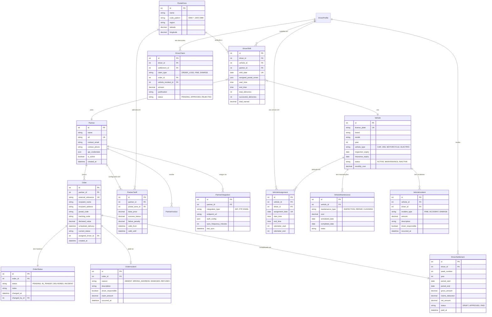
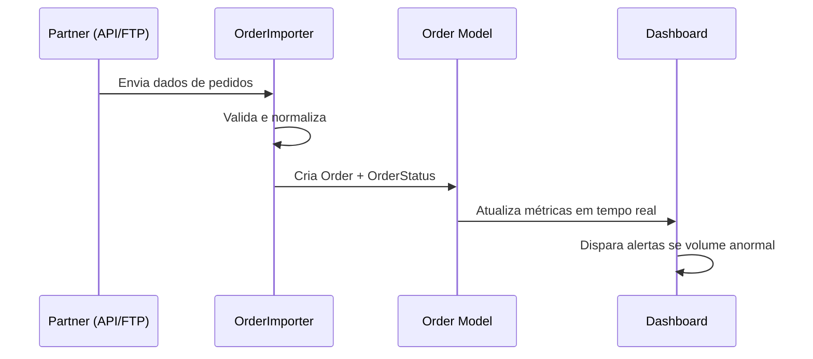
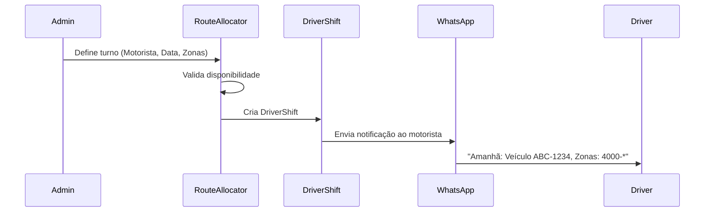
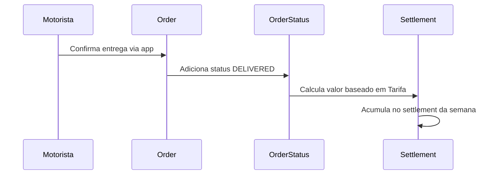
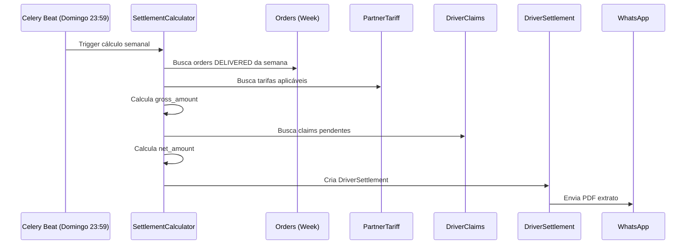

# 🏗️ Arquitetura do Sistema - Léguas Franzinas

## Visão Geral da Arquitetura

Sistema modular Django para gestão logística multi-partner com foco em escalabilidade, rastreabilidade e automação financeira.

---

## 📐 Diagrama de Entidade-Relacionamento (ER)

### Arquitetura Completa (Futura)



---

## 🗂️ Estrutura de Apps Django

```
leguas/
├── core/                      # App central (Partners, Configs)
│   ├── models.py
│   │   ├── Partner
│   │   └── PartnerIntegration
│   ├── admin.py
│   ├── views.py
│   └── serializers.py
│
├── orders_manager/            # Gestão genérica de pedidos
│   ├── models.py
│   │   ├── Order
│   │   ├── OrderStatus
│   │   └── OrderIncident
│   ├── services/
│   │   ├── order_importer.py  # Factory pattern por Partner
│   │   ├── paack_importer.py
│   │   ├── amazon_importer.py
│   │   └── generic_importer.py
│   └── management/
│       └── commands/
│           └── import_orders.py
│
├── fleet_management/          # Gestão de veículos
│   ├── models.py
│   │   ├── Vehicle
│   │   ├── VehicleAssignment
│   │   ├── VehicleMaintenance
│   │   └── VehicleIncident
│   ├── views.py
│   └── dashboards/
│       └── fleet_status.html
│
├── pricing/                   # Zonas e tarifas
│   ├── models.py
│   │   ├── PostalZone
│   │   ├── PartnerTariff
│   │   └── TariffModifier
│   ├── calculators/
│   │   └── price_calculator.py
│   └── management/
│       └── commands/
│           └── import_postal_zones.py
│
├── route_allocation/          # Turnos e rotas
│   ├── models.py
│   │   ├── DriverShift
│   │   └── ShiftPerformance
│   ├── algorithms/
│   │   └── route_optimizer.py
│   └── views.py
│
├── settlements/               # Financeiro (já existe, evoluir)
│   ├── models.py
│   │   ├── PartnerInvoice     # NOVO
│   │   ├── DriverSettlement   # EVOLUIR
│   │   └── DriverClaim        # NOVO
│   ├── calculators/
│   │   ├── settlement_calculator.py
│   │   └── claim_processor.py
│   └── reports/
│       └── pdf_generator.py
│
├── drivers_app/               # Motoristas (já existe)
│   └── models.py
│       └── DriverProfile
│
└── analytics/                 # Dashboards e forecasting (NOVO)
    ├── views.py
    ├── forecasting/
    │   └── volume_predictor.py
    └── templates/
        └── analytics/
```

---

## 🔄 Fluxo de Dados Principal

### 1. Importação de Pedidos



### 2. Atribuição de Turno



### 3. Processamento de Entrega



### 4. Cálculo de Settlement Semanal



---

## 🎨 Camadas de Abstração

### Layer 1: Models (Data)
- **Responsabilidade**: Estrutura de dados, validações básicas
- **Exemplo**: `Order.clean()` valida se postal_code existe em PostalZone

### Layer 2: Services (Business Logic)
- **Responsabilidade**: Regras de negócio complexas
- **Exemplo**: `OrderImporter` - lida com diferentes formatos de Partners

### Layer 3: Calculators (Computação)
- **Responsabilidade**: Cálculos financeiros e matemáticos
- **Exemplo**: `PriceCalculator` - aplica tarifas + modificadores

### Layer 4: Views (Presentation)
- **Responsabilidade**: Interface com usuário/API
- **Exemplo**: `OrderListView` - exibe pedidos com filtros

### Layer 5: Tasks (Async)
- **Responsabilidade**: Operações pesadas em background
- **Exemplo**: `calculate_weekly_settlements.delay()`

---

## 🔐 Segurança e Permissões

### Níveis de Acesso

| Role | Permissões |
|------|-----------|
| **Super Admin** | Tudo |
| **Admin Financeiro** | Ver/Editar Settlements, Tarifas, Invoices |
| **Admin Operacional** | Ver/Editar Orders, Shifts, Fleet |
| **Motorista** | Ver próprios Shifts, Settlements, Orders |
| **Partner (API)** | Criar Orders, Ver status de seus Orders |

### Auditoria
- Todas as operações críticas (`OrderStatus`, `DriverClaim`, `Settlement`) têm:
  - `created_by` (quem fez)
  - `created_at` (quando)
  - `modified_by` / `modified_at`

---

## 📊 Performance e Escalabilidade

### Database Indexing
```python
# Indexes críticos
Order.Meta.indexes = [
    Index(fields=['partner', 'created_at']),
    Index(fields=['assigned_driver', 'current_status']),
    Index(fields=['postal_code']),
]

DriverShift.Meta.indexes = [
    Index(fields=['driver', 'shift_date']),
    Index(fields=['partner', 'shift_date']),
]
```

### Caching Strategy
- **Redis**: Cache de tarifas (expiração: 1 hora)
- **DB Query Cache**: Dashboard metrics (5 minutos)
- **Static Files**: CDN (CloudFlare)

### Background Tasks (Celery)
```python
# celery.py
app.conf.beat_schedule = {
    'calculate-weekly-settlements': {
        'task': 'settlements.tasks.calculate_weekly_settlements',
        'schedule': crontab(day_of_week=0, hour=23, minute=59),
    },
    'sync-partner-orders': {
        'task': 'orders.tasks.sync_all_partners',
        'schedule': crontab(minute='*/15'),  # A cada 15 min
    },
    'check-vehicle-expiries': {
        'task': 'fleet.tasks.alert_expiring_documents',
        'schedule': crontab(hour=8, minute=0),  # Diário 8h
    },
}
```

---

## 🧪 Testing Strategy

### Pirâmide de Testes

```
        /\
       /  \  E2E (5%)
      /____\
     /      \  Integration (15%)
    /________\
   /          \ Unit (80%)
  /______________\
```

### Exemplos

**Unit Test**:
```python
def test_price_calculator_applies_tariff():
    order = Order(postal_code='4000-001', partner=paack)
    tariff = PartnerTariff(partner=paack, base_price=5.0)
    calc = PriceCalculator()
    assert calc.calculate(order, tariff) == 5.0
```

**Integration Test**:
```python
def test_order_to_settlement_flow():
    order = create_order(driver=driver1, status='DELIVERED')
    settlement = SettlementCalculator().calculate_for_week(driver1, week=10)
    assert settlement.gross_amount == expected_value
```

**E2E Test**:
```python
def test_admin_creates_shift_driver_receives_whatsapp():
    # Selenium test simulando criação de turno
    admin.create_shift(driver=driver1, date='2026-03-01')
    # Mock do WhatsApp
    assert whatsapp_mock.sent_messages[0].contains('Veículo')
```

---

## 📈 Monitoring e Logs

### Métricas (Prometheus + Grafana)
- Latência de APIs
- Taxa de sucesso de importação
- Número de orders por status
- Taxa de erro em settlements

### Logs Estruturados (JSON)
```json
{
  "timestamp": "2026-02-27T15:30:00Z",
  "level": "INFO",
  "service": "orders_manager",
  "action": "order_created",
  "partner_id": 1,
  "order_id": 12345,
  "user": "admin@leguas.pt"
}
```

### Alertas (Sentry)
- Erro em cálculo de settlement
- Falha em sincronização de Partner
- Timeout em API de importação

---

## 🔄 Migração de Dados

### Estratégia de Migração (`ordersmanager_paack` → `orders_manager`)

```python
# management/commands/migrate_paack_orders.py

from django.core.management.base import BaseCommand
from ordersmanager_paack.models import PaackOrder
from orders_manager.models import Order
from core.models import Partner

class Command(BaseCommand):
    def handle(self, *args, **options):
        # 1. Criar Partner "Paack"
        paack, _ = Partner.objects.get_or_create(
            name="Paack",
            nif="123456789",
            defaults={'api_credentials': {...}}
        )
        
        # 2. Migrar orders
        for old_order in PaackOrder.objects.all():
            Order.objects.get_or_create(
                external_reference=old_order.tracking_code,
                defaults={
                    'partner': paack,
                    'recipient_name': old_order.recipient,
                    'postal_code': old_order.postal_code,
                    # ... mapeamento de campos
                }
            )
        
        self.stdout.write(self.style.SUCCESS('Migração concluída!'))
```

---

## 📚 Documentação Adicional

- [MODELS_REFERENCE.md](./MODELS_REFERENCE.md) - Referência completa de todos os models
- [API_ENDPOINTS.md](./API_ENDPOINTS.md) - Documentação de APIs REST
- [DEPLOYMENT.md](./DEPLOYMENT.md) - Guia de deploy e configuração de servidores

---

**Última atualização**: 27/02/2026  
**Versão da Arquitetura**: 2.0 (Multi-Partner)
