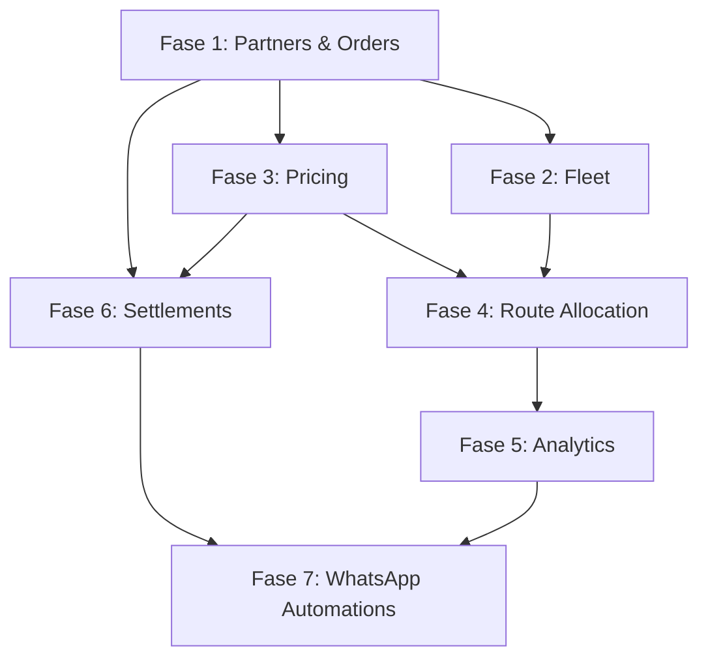

# 🚀 Roadmap de Evolução - Léguas Franzinas

## Visão Geral

Transformar o sistema atual focado em Paack numa **plataforma multi-partner de gestão logística completa**, permitindo operação com múltiplas transportadoras (Amazon, DPD, CTT, etc.) de forma desacoplada e escalável.

---

## 📊 Arquitetura Atual vs. Futura

### Atual (Single Partner - Paack)
```
┌─────────────────┐
│ ordersmanager_  │ ──► Apenas Paack
│     paack       │
└─────────────────┘
         │
    ┌────┴────┐
    │ Drivers │
    └─────────┘
```

### Futura (Multi-Partner)
```
┌──────────┐
│ Partners │◄───┐
└────┬─────┘    │
     │          │
┌────▼─────┐    │
│  Orders  │────┤
│ (Generic)│    │
└────┬─────┘    │
     │          │
┌────▼─────┐    │
│ Drivers  │────┤
└────┬─────┘    │
     │          │
┌────▼─────┐    │
│  Fleet   │────┤
└──────────┘    │
                │
┌───────────┐   │
│  Tariffs  │───┘
│  & Zones  │
└───────────┘
```

---

## 📈 Status Geral da Migração

**Última atualização**: 27 de Fevereiro de 2026

### ✅ Fase 1 - Fundação (CONCLUÍDA)
- 🟢 5 apps Django criadas (core, orders_manager, fleet_management, pricing, route_allocation)
- 🟢 15+ models implementados com business logic
- 🟢 Admin interfaces configuradas
- 🟢 Migrations aplicadas
- 🟢 Management commands criados
- 🟢 11 zonas postais de Portugal configuradas
- 🟢 11 tarifas configuradas para Paack

### 🔄 Fase 2 - Dual Write (EM PROGRESSO)
- 🟢 **DUAL_WRITE_ORDERS = True** (ATIVADO em 27/02/2026)
- 🟢 OrderAdapter implementado
- 🟢 Validation automática ativada
- 🟢 Logging de operações ativado
- � Analytics app criada (forecasting e métricas)
- �🟡 Monitoramento diário configurado (aguardando 1-2 semanas)
- ⚪ USE_GENERIC_ORDERS_READ = False (ainda lê do sistema antigo)

**Próximo passo**: Monitorar consistência por 1-2 semanas antes de ativar leitura do novo sistema.

---

## 🎯 Fases de Implementação

### **Fase 1: Fundação Multi-Partner** (Prioridade: CRÍTICA)
**Objetivo**: Criar infraestrutura base para operar com múltiplos parceiros

#### 1.A - App `core` (Partners)
**Status**: � Concluído (27/02/2026)  
**Prazo estimado**: 1 semana  

**Entregáveis**:
- ✅ Model `Partner` (Nome, NIF, API Keys, Configs)
- ✅ Model `PartnerIntegration` (Tipo: API, FTP, Email)
- ✅ Admin interface para gestão de Partners
- ✅ Migration de dados Paack → Partner genérico

**Impacto**: Alto - Base para todas as outras features

#### 1.B - App `orders_manager` (Genérico)
**Status**: � Concluído (27/02/2026)  
**Prazo estimado**: 2 semanas  

**Entregáveis**:
- ✅ Refatoração de `ordersmanager_paack`
- ✅ Model `Order` com FK para `Partner`
- ✅ Model `OrderStatus` (histórico de estados)
- ✅ Model `OrderIncident` (motivos de falha)
- ✅ API genérica de importação de pedidos
- ✅ Management command de migração de dados

**Impacto**: Alto - Desacopla lógica de negócio

---

### **Fase 2: Gestão de Frota** (Prioridade: ALTA)
**Objetivo**: Rastrear veículos, manutenções e atribuições

#### 2.A - App `fleet_management`
**Status**: � Concluído (27/02/2026)  
**Prazo estimado**: 1.5 semanas  

**Entregáveis**:
- ✅ Model `Vehicle` (Matrícula, Tipo, Inspeção, Seguro)
- ✅ Model `VehicleAssignment` (Histórico Motorista x Veículo)
- ✅ Model `VehicleMaintenance` (Agendamentos e custos)
- ✅ Model `VehicleIncident` (Multas, Acidentes, Claims)
- ✅ Dashboard de status da frota
- ✅ Alertas de vencimento (Inspeção, Seguro)

**Impacto**: Médio-Alto - Essencial para responsabilização e custos

---

### **Fase 3: Tarifação e Zonas Postais** (Prioridade: ALTA)
**Objetivo**: Valores diferentes por partner e região

#### 3.A - App `pricing`
**Status**: � Concluído (27/02/2026)  
**Prazo estimado**: 2 semanas  

**Entregáveis**:
- ✅ Model `PostalZone` (Agrupamento de CPs)
- ✅ Model `PartnerTariff` (Partner x Zona x Valores)
- ✅ Model `TariffModifier` (Bônus/Penalidades por performance)
- ✅ Calculadora automática de valores
- ✅ Importação em massa de zonas (CSV)
- ✅ Interface de configuração por Partner

**Impacto**: Alto - Diferencial comercial

---

### **Fase 4: Atribuição de Rotas e Turnos** (Prioridade: MÉDIA)
**Objetivo**: Agendar motoristas em zonas específicas

#### 4.A - App `route_allocation`
**Status**: � Concluído (27/02/2026)  
**Prazo estimado**: 2 semanas  

**Entregáveis**:
- ✅ Model `DriverShift` (Data, Motorista, Veículo, Partner, Zonas)
- ✅ Model `ShiftPerformance` (KPIs do turno)
- ✅ Algoritmo de sugestão automática de rotas
- ✅ Calendário visual de turnos
- ✅ Notificações WhatsApp com detalhes do turno

**Impacto**: Médio - Otimiza operação diária

---

### **Fase 5: Relatórios e Analytics** (Prioridade: MÉDIA)
**Objetivo**: Dashboards de performance e forecasting

#### 5.A - Dashboards Avançados
**Status**: ✅ Concluído (27/02/2026)  
**Prazo estimado**: 1.5 semanas  

**Entregáveis**:
- ✅ Dashboard consolidado multi-partner
- ✅ Relatório de incidências (Top motivos de falha)
- ✅ Performance por motorista (Taxa de sucesso)
- ✅ Performance por veículo (Custo x Entregas)
- ✅ Exportação de relatórios em Excel/PDF

**Impacto**: Médio - Visibilidade de negócio

**Detalhes de Implementação**:
- **Views**: 7 dashboards + 4 API endpoints JSON + 3 exportações (Excel/PDF)
- **Templates**: 4 dashboards responsivos com Tailwind CSS e dark mode
- **Features**: Filtros por data/partner/mês, color-coded status, rankings, KPIs visuais
- **URLs**: 13 endpoints registrados em /analytics/
- **Exportações**: openpyxl (Excel) + reportlab (PDF)

#### 5.B - Analytics e Forecasting
**Status**: ✅ Concluído (27/02/2026)  
**Prazo estimado**: 1 semana  

**Entregáveis**:
- ✅ App `analytics` criada com 4 models (DailyMetrics, VolumeForecast, PerformanceAlert, DriverPerformance)
- ✅ Forecasting com 5 métodos estatísticos (MA7, MA30, EMA, TREND, SEASONAL)
- ✅ Cálculo de métricas diárias (pedidos, sucesso, receita, motoristas, veículos)
- ✅ Sistema de alertas automáticos (6 tipos de alertas × 3 níveis de severidade)
- ✅ Performance tracking mensal de motoristas com rankings
- ✅ Confidence intervals e prediction bounds
- ✅ Management commands (calculate_daily_metrics, generate_forecasts, check_performance_alerts)
- ✅ Admin interface com color-coding e ações customizadas
- ✅ Visualizações dashboards (concluído)
- ✅ Cron Jobs automation configurados

**Impacto**: Médio-Alto - Forecasting permite planejamento estratégico de FTE

**Detalhes Técnicos**:
- **MetricsCalculator**: Agrega dados de pedidos em cache diário para performance
- **VolumeForecaster**: 5 algoritmos de previsão com níveis de confiança
- **PerformanceAlert**: Monitora thresholds (taxa sucesso < 80%, falhas > 15%, tempo entrega > 48h, etc.)
- **DriverPerformance**: Rankings mensais e financial tracking

---

### **Fase 6: Financeiro (Settlements & Claims)** (Prioridade: ALTA)
**Objetivo**: Automatizar cálculos de recebíveis e descontos

#### 6.A - Evolução do App `settlements`
**Status**: 🟡 Parcial (existe básico)  
**Prazo estimado**: 2 semanas  

**Entregáveis**:
- ✅ Model `PartnerInvoice` (A receber das transportadoras)
- ✅ Model `DriverSettlement` (Semanal com detalhamento)
- ✅ Model `DriverClaim` (Multas, Perdas, Danos)
- ✅ Cálculo automático baseado em `Order` + `Tariff`
- ✅ Reconciliação automática (Delivered x Paid)
- ✅ Geração de PDF de extrato
- ✅ Envio automático via WhatsApp

**Impacto**: Alto - Core financeiro

---

### **Fase 7: Automações WhatsApp** (Prioridade: BAIXA)
**Objetivo**: Comunicação proativa com motoristas

#### 7.A - Notificações Automáticas
**Status**: 🟡 Parcial (infraestrutura existe)  
**Prazo estimado**: 1 semana  

**Entregáveis**:
- ✅ Notificação diária de turno (Veículo + Zonas)
- ✅ Extrato semanal em PDF
- ✅ Alertas de documentação vencida
- ✅ Confirmação de recebimento de pacotes
- ✅ Feedback de incidentes (formulário TypeBot)

**Impacto**: Baixo-Médio - Melhora UX

---

## 🗓️ Timeline Proposto

```
Mês 1: Fase 1 (Fundação Multi-Partner)
├─ Semana 1-2: core (Partners)
└─ Semana 3-4: orders_manager (Genérico)

Mês 2: Fases 2 e 3
├─ Semana 1-2: fleet_management
└─ Semana 3-4: pricing (Zonas e Tarifas)

Mês 3: Fases 4, 5 e 6
├─ Semana 1-2: route_allocation + Dashboards
└─ Semana 3-4: settlements (Financeiro)

Mês 4: Refinamento e Automações
└─ Fase 7 + Testes + Documentação
```

**Total estimado**: 3-4 meses para stack completo

---

## 📦 Dependências Entre Fases



---

## 🎯 Quick Wins (Prioridades Imediatas)

### Semana 1-2: Fundação
1. **Criar app `core`** com model Partner
2. **Management command** para criar Partner "Paack" com configs atuais
3. **Adicionar FK Partner** nos models existentes (sem quebrar)

### Semana 3-4: Migração Suave
4. **Duplicar lógica** de `ordersmanager_paack` em `orders_manager`
5. **Script de migração** de dados antigos
6. **Manter ambos rodando** em paralelo por 1 mês

### Mês 2: Expansão
7. **Fleet management** básico (Vehicles + Assignments)
8. **Pricing** com 1 zona de teste (Lisboa)

---

## 🔧 Stack Técnico

### Backend
- **Django 4.2+** (Apps modulares)
- **Celery** (Tasks assíncronas de cálculo)
- **Django REST Framework** (APIs para integração)

### Frontend
- **Alpine.js** (Dashboard interativo)
- **Chart.js** (Gráficos de analytics)
- **Tailwind CSS** (UI consistente)

### Integrações
- **WPPConnect** (WhatsApp)
- **TypeBot** (Automações de chat)
- **Paack/Amazon/DPD APIs** (Importação de pedidos)

---

## 📊 KPIs de Sucesso

### Operacionais
- ✅ Tempo de onboarding de novo Partner: < 1 dia
- ✅ Reconciliação financeira automática: > 95%
- ✅ Taxa de erro em cálculos: < 0.1%

### Técnicos
- ✅ Cobertura de testes: > 80%
- ✅ Tempo de resposta de APIs: < 500ms
- ✅ Uptime: > 99.5%

### Negócio
- ✅ Redução de trabalho manual: > 70%
- ✅ Visibilidade de custos em tempo real
- ✅ Capacidade de adicionar novo Partner em < 2 horas

---

## 🚧 Riscos e Mitigações

| Risco | Probabilidade | Impacto | Mitigação |
|-------|---------------|---------|-----------|
| Migração de dados quebrar produção | Média | Alto | Manter sistemas em paralelo por 1 mês |
| APIs de Partners instáveis | Alta | Médio | Sistema de retry + fallback manual |
| Complexidade de cálculos financeiros | Média | Alto | Testes extensivos + validação manual inicial |
| Resistência de motoristas a mudanças | Baixa | Baixo | Treinamento + suporte via WhatsApp |

---

## 📝 Notas de Implementação

### Backwards Compatibility
- Manter `ordersmanager_paack` funcionando durante migração
- Criar feature flags para ativar novos módulos gradualmente
- Logs extensivos de todas as operações críticas

### Data Migration Strategy
1. **Snapshot** do banco antes de cada fase
2. **Scripts idempotentes** (podem rodar múltiplas vezes)
3. **Validação** automática de migração (contagens, somas)

### Testing Strategy
- **Unit tests**: Cada modelo e função crítica
- **Integration tests**: Fluxos completos (Order → Settlement)
- **Load tests**: Simular 10k pedidos/dia

---

## 🎓 Documentação Adicional

- [ARCHITECTURE.md](./ARCHITECTURE.md) - Diagramas ER detalhados
- [MIGRATION_GUIDE.md](./MIGRATION_GUIDE.md) - Passo a passo de migração
- [API_DOCS.md](./API_DOCS.md) - Endpoints para integrações
- [INTEGRATION_PARTNERS.md](./INTEGRATION_PARTNERS.md) - Como integrar novos Partners

---

**Última atualização**: 27/02/2026  
**Responsável**: Equipe de Desenvolvimento Léguas Franzinas
