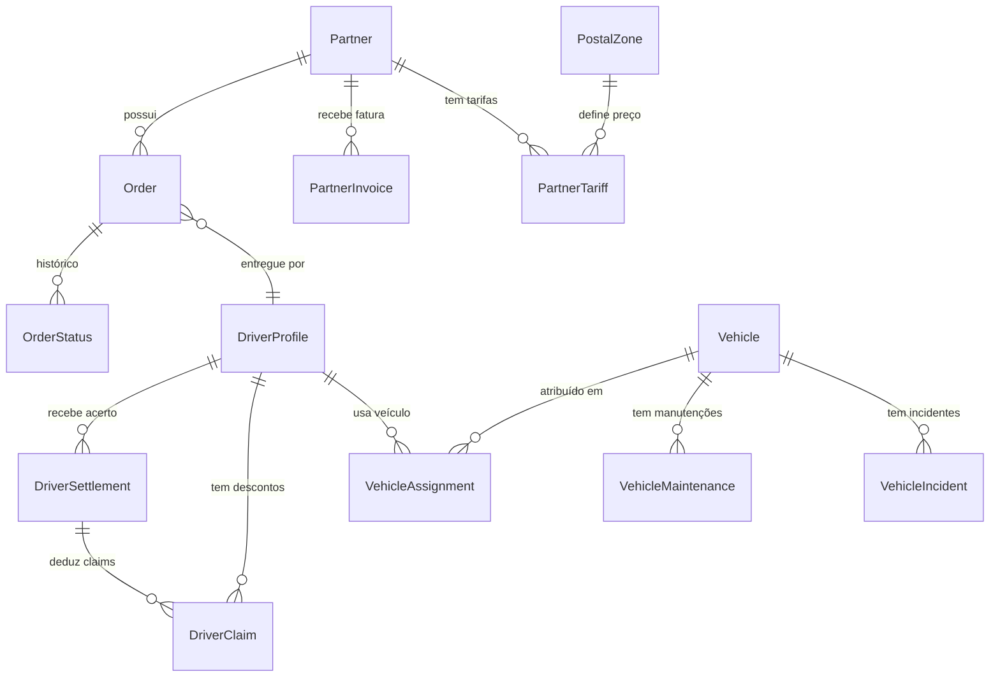
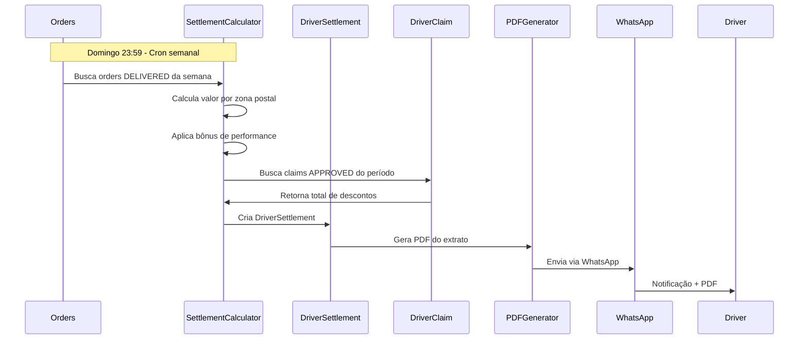

# 📚 Sistema Léguas Franzinas - Documentação Completa

**Última Atualização**: 28 de Fevereiro de 2026  
**Versão do Sistema**: 2.1.0  
**Status**: Produção

---

## 📖 Índice

1. [Visão Geral](#visão-geral)
2. [Arquitetura do Sistema](#arquitetura-do-sistema)
3. [Módulos Implementados](#módulos-implementados)
4. [Sistema Financeiro](#sistema-financeiro)
5. [Guia de Uso](#guia-de-uso)
6. [Deployment e Manutenção](#deployment-e-manutenção)
7. [Roadmap e Próximos Passos](#roadmap-e-próximos-passos)
8. [Troubleshooting](#troubleshooting)

---

## 🎯 Visão Geral

### O que é o Sistema Léguas Franzinas?

Sistema integrado de gestão logística para operações de entrega last-mile, com foco em:
- **Gestão de Pedidos** multi-partner (Paack, Amazon, DPD, etc.)
- **Gestão de Frota** (veículos, manutenções, atribuições)
- **Gestão Financeira** (faturas, acertos de motoristas, descontos)
- **Analytics e Forecasting** (métricas, previsões, alertas)
- **Integração WhatsApp** (notificações, automações)

### Tecnologias Utilizadas

**Backend**:
- Django 4.2.22 (Python 3.11)
- MySQL 8.0
- Redis (cache e Celery)
- Celery (tarefas assíncronas)

**Frontend**:
- Tailwind CSS 3.x
- Alpine.js (interatividade)
- Lucide Icons
- Chart.js (gráficos)

**Integrações**:
- WPPConnect (WhatsApp)
- TypeBot (automações de chat)
- APIs de parceiros (Paack, Amazon, DPD)

**Infraestrutura**:
- Docker + Docker Compose
- Gunicorn (WSGI)
- Nginx (reverse proxy)

---

## 🏗️ Arquitetura do Sistema

### Estrutura de Apps Django

```
leguas/
├── core/                      # Gestão de parceiros e configurações globais
├── orders_manager/            # Pedidos genéricos multi-partner
├── ordersmanager_paack/       # Legacy Paack (em fase de deprecação)
├── fleet_management/          # Veículos e atribuições
├── pricing/                   # Zonas postais e tarifas
├── route_allocation/          # Turnos e alocação de rotas
├── settlements/               # Sistema financeiro (CORE)
├── analytics/                 # Dashboards e forecasting
├── drivers_app/               # Perfil de motoristas
├── accounting/                # Contabilidade (experimental)
├── customauth/                # Autenticação customizada
└── my_project/                # Settings e configs
```

### Diagrama de Entidades Principais



---

## 📦 Módulos Implementados

### ✅ 1. Sistema Financeiro (Settlements)

**Status**: **COMPLETO** (implementado em 27-28/02/2026)

#### 1.1 Models

**PartnerInvoice** - Faturas a receber de parceiros
- Campos: `invoice_number`, `partner`, `period_start/end`, `gross_amount`, `tax_amount`, `net_amount`
- Status: DRAFT → PENDING → PAID → OVERDUE → CANCELLED
- Métodos: `calculate_totals()`, `mark_as_paid()`, `check_overdue()`

**DriverSettlement** - Acertos semanais/mensais de motoristas
- Campos: `driver`, `period_type` (WEEKLY/MONTHLY), `gross_amount`, `bonus_amount`, `net_amount`
- Cálculo automático baseado em:
  * Tarifas por zona postal
  * Bônus de performance (2-10% conforme taxa de sucesso)
  * Descontos: combustível, claims, outros
- Métodos: `calculate_settlement()`, `approve()`, `mark_as_paid()`

**DriverClaim** - Descontos e multas
- 9 tipos: ORDER_LOSS, VEHICLE_FINE, VEHICLE_DAMAGE, FUEL_EXCESS, etc.
- Workflow: PENDING → APPROVED/REJECTED → APPEALED → DEDUCTED
- Métodos: `approve()`, `reject()`, `appeal()`

#### 1.2 Calculators (Business Logic)

**SettlementCalculator** (`settlements/calculators/settlement_calculator.py`)
```python
# Exemplos de uso:
from settlements.calculators import SettlementCalculator

# Calcular acerto semanal
settlement = SettlementCalculator.calculate_weekly_settlement(
    driver_id=1, week_number=9, year=2026
)

# Calcular para todos os motoristas
settlements = SettlementCalculator.calculate_all_weekly_settlements(
    week_number=9, year=2026
)
```

**ClaimProcessor** (`settlements/calculators/claim_processor.py`)
- Auto-criação de claims de pedidos falhados
- Processamento de multas de veículos
- Aplicação de claims a settlements

**InvoiceCalculator** (`settlements/calculators/invoice_calculator.py`)
- Geração de faturas mensais para partners
- Reconciliação de pagamentos
- Verificação de faturas vencidas

#### 1.3 Management Commands

```bash
# Calcular acertos semanais
python manage.py calculate_weekly_settlements --week 9 --year 2026

# Gerar faturas mensais
python manage.py calculate_monthly_invoices --month 2 --year 2026

# Processar claims pendentes
python manage.py process_pending_claims --auto-create

# Criar dados de exemplo
python manage.py create_financial_sample_data
```

#### 1.4 Interfaces Web

**URLs Base**: `/settlements/`

| URL | Descrição | Status |
|-----|-----------|--------|
| `/settlements/` | Dashboard financeiro | ✅ |
| `/settlements/invoices/` | Lista de faturas | ✅ |
| `/settlements/invoices/<id>/` | Detalhes de fatura | ✅ |
| `/settlements/invoices/<id>/pdf/` | Download PDF | ✅ |
| `/settlements/settlements/` | Lista de acertos | ✅ |
| `/settlements/settlements/<id>/` | Detalhes de acerto | ✅ |
| `/settlements/settlements/<id>/pdf/` | Download PDF acerto | ✅ |
| `/settlements/claims/` | Lista de claims | ✅ |
| `/settlements/claims/<id>/` | Detalhes de claim | ✅ |

**Funcionalidades Implementadas** (28/02/2026):
- ✅ **Paginação** (25 itens por página) em todas as listas
- ✅ **Filtros de data** (date_from, date_to)
- ✅ **Filtros de status** (dropdowns)
- ✅ **Busca** por nome/número
- ✅ **Design moderno** com Tailwind CSS
- ✅ **Dark mode** support
- ✅ **Ícones Lucide** em todos os cards
- ✅ **Status badges** coloridos
- ✅ **Timeline** de eventos
- ✅ **Breakdown financeiro** detalhado
- ✅ **Geração de PDF** com reportlab
- ✅ **Responsive design** (mobile-first)

#### 1.5 Admin Customizado

Acesso: `/admin/settlements/`

**Funcionalidades**:
- Filtros avançados (período, status, partner, motorista)
- Color badges para status
- Ações em massa (aprovar, recalcular, marcar como pago)
- Inlines de claims em settlements
- Exportação de dados

---

### ✅ 2. Analytics e Forecasting

**Status**: **COMPLETO** (implementado em 27/02/2026)

#### 2.1 Models

**DailyMetrics** - Métricas agregadas diárias
- Orders totais, entregues, falhados
- Receita diária
- Motoristas e veículos ativos

**VolumeForecast** - Previsões de volume
- 5 métodos: Moving Average 7/30 dias, EMA, Trend, Seasonal
- Confidence intervals (80%, 95%)
- Horizon: 1-30 dias

**PerformanceAlert** - Alertas automáticos
- 6 tipos de alertas (baixa taxa de sucesso, muitas falhas, atrasos, etc.)
- 3 níveis: INFO, WARNING, CRITICAL

**DriverPerformance** - Performance mensal de motoristas
- Rankings automáticos
- Taxa de sucesso, total entregue, receita gerada

#### 2.2 Dashboards

| Dashboard | URL | Descrição |
|-----------|-----|-----------|
| Overview | `/analytics/` | Visão geral com KPIs principais |
| Incidents | `/analytics/incidents/` | Top motivos de falha |
| Drivers | `/analytics/drivers/` | Performance por motorista |
| Vehicles | `/analytics/vehicles/` | Performance por veículo |

**Exportações**:
- Excel (openpyxl): `/analytics/export/excel/`
- PDF (reportlab): `/analytics/export/pdf/`

---

### ✅ 3. Gestão de Pedidos (Orders)

**Status**: **DUAL WRITE ATIVO** (transição em andamento)

#### 3.1 Models

**Order** (novo sistema genérico)
- FK para Partner (multi-partner ready)
- Status: PENDING → ASSIGNED → IN_TRANSIT → DELIVERED / FAILED
- Campos: tracking_code, postal_code, delivery_date, valor, etc.

**OrderStatus** - Histórico de mudanças de status
**OrderIncident** - Motivos de falha/incidente

#### 3.2 Order Adapter (Transição)

**Feature Flags** (my_project/settings.py):
```python
FEATURE_FLAGS = {
    'USE_GENERIC_ORDERS': True,      # ✅ Escreve em ambos os sistemas
    'READ_FROM_GENERIC_ORDERS': False,  # ⚠️  Ainda lê do Paack
    'SETTLEMENTS_FROM_GENERIC': False,  # ⚠️  Settlements usa Paack
}
```

**Status**: Sistema antigo (ordersmanager_paack) e novo (orders_manager) rodando em paralelo.

---

### ✅ 4. Gestão de Frota

**Status**: **COMPLETO**

#### 4.1 Models

**Vehicle** - Veículos da frota
- Matrícula, tipo, inspeção, seguro, custos mensais

**VehicleAssignment** - Histórico de atribuições
- Motorista x Veículo x Período

**VehicleMaintenance** - Manutenções agendadas/realizadas

**VehicleIncident** - Multas, acidentes, danos

#### 4.2 Dashboards

- Status da frota (disponível, em uso, manutenção)
- Alertas de vencimento (inspeção, seguro)
- Custos por veículo

---

### ✅ 5. Pricing e Zonas Postais

**Status**: **COMPLETO**

#### 5.1 Models

**PostalZone** - Agrupamento de códigos postais
- 11 zonas configuradas para Portugal

**PartnerTariff** - Tarifas por partner e zona
- Base price + modifiers
- Válido de/até (histórico de tarifas)

**TariffModifier** - Bônus/penalidades por performance

#### 5.2 Calculator

**PriceCalculator** - Calcula preço por pedido
- Baseado em zona postal + tarifa + modificadores

---

### ✅ 6. Alocação de Rotas

**Status**: **COMPLETO**

#### 6.1 Models

**DriverShift** - Turnos planejados
- Data, motorista, veículo, partner, zonas atribuídas

**ShiftPerformance** - KPIs do turno
- Entregas esperadas vs. realizadas
- Taxa de sucesso do turno

---

### ⚠️  7. Integrações WhatsApp

**Status**: **PARCIAL** (infraestrutura existe)

**Implementado**:
- ✅ WPPConnect configurado
- ✅ TypeBot flows criados
- ✅ Envio de mensagens via API

**Pendente**:
- ⚪ Envio automático de extratos semanais
- ⚪ Notificações diárias de turnos
- ⚪ Alertas de documentação vencida

---

## 💰 Sistema Financeiro - Detalhes

### Fluxo Completo



### Cálculo de Settlement

**Fórmula**:
```
GROSS AMOUNT = Σ (orders_delivered_per_zone × tariff_per_zone)

BONUS = GROSS × bonus_percentage
  onde bonus_percentage:
    - 2%  se taxa_sucesso ≥ 85%
    - 5%  se taxa_sucesso ≥ 90%
    - 10% se taxa_sucesso ≥ 95%

DEDUCTIONS = fuel_cost + claims_total + other_costs

NET AMOUNT = GROSS + BONUS - DEDUCTIONS
```

**Exemplo Prático**:
```
Motorista: João Silva
Período: Semana 9/2026 (23/02 - 01/03)
Partner: Paack

Entregas:
  - Zona 4000-*: 45 entregas × €3.50 = €157.50
  - Zona 4100-*: 30 entregas × €4.00 = €120.00
  - Zona 4200-*: 25 entregas × €3.80 = €95.00
  ----------------------------------------
  GROSS: €372.50

Performance:
  - Total pedidos: 105
  - Entregues: 100
  - Taxa sucesso: 95.2%
  - BONUS: €372.50 × 10% = €37.25

Descontos:
  - Combustível: €50.00
  - Claim (multa trânsito): €35.00
  - Outros: €0.00
  ----------------------------------------
  DEDUCTIONS: €85.00

NET AMOUNT: €372.50 + €37.25 - €85.00 = €324.75
```

### Tipos de Claims (Descontos)

| Tipo | Código | Origem | Valor Típico |
|------|--------|--------|--------------|
| Perda de mercadoria | ORDER_LOSS | Auto (order failed) | Valor do produto |
| Multa de trânsito | VEHICLE_FINE | Manual / VehicleIncident | €50-€500 |
| Dano ao veículo | VEHICLE_DAMAGE | VehicleIncident | Custo do reparo |
| Dano ao uniforme | UNIFORM_DAMAGE | Manual | €20-€50 |
| Atraso na entrega | LATE_DELIVERY | Auto (order) | €5-€15 |
| Reclamação cliente | CUSTOMER_COMPLAINT | Order / Manual | €10-€30 |
| Excesso combustível | FUEL_EXCESS | Manual | Diferença real vs. esperado |
| Perda equipamento | EQUIPMENT_LOSS | Manual | Valor do equipamento |
| Outros | OTHER | Manual | Variável |

---

## 🚀 Guia de Uso

### Acesso ao Sistema

**URLs**:
- **Produção**: https://app.leguasfranzinas.pt
- **Local**: http://localhost:8000

**Credenciais Padrão**:
```
Admin: admin@leguas.pt / [verificar CREDENCIAIS_ACESSO.md]
Motorista: [nome]@leguas.pt / [senha padrão]
```

### Workflow Semanal Típico

#### Segunda-feira (Início da Semana)
1. **Verificar Alerts** em `/analytics/`
2. **Revisar Claims Pendentes** em `/settlements/claims/`
3. **Planejar Turnos** da semana

#### Terça a Sexta (Operação Diária)
1. **Importar Orders** do dia (auto via cron ou manual)
2. **Atribuir Motoristas** via `/route_allocation/shifts/`
3. **Monitorar Performance** em `/analytics/drivers/`
4. **Processar Incidents** em `/fleet_management/incidents/`

#### Sábado (Revisão)
1. **Revisar Orders da Semana** em `/orders_manager/`
2. **Criar Claims** de pedidos falhados:
   ```bash
   python manage.py process_pending_claims --auto-create
   ```
3. **Aprovar/Rejeitar Claims** em `/admin/settlements/driverclaim/`

#### Domingo (Fechamento)
1. **Calcular Settlements**:
   ```bash
   # Cron automático às 23:59 ou manual:
   python manage.py calculate_weekly_settlements --week 9 --year 2026
   ```
2. **Gerar Faturas de Partners**:
   ```bash
   # Se fim de mês:
   python manage.py calculate_monthly_invoices --month 2 --year 2026
   ```
3. **Enviar Extratos** via WhatsApp (pendente automação)

### Aprovação de Settlement (Admin Financeiro)

1. Acessar `/admin/settlements/driversettlement/`
2. Filtrar por semana e status "CALCULATED"
3. Revisar:
   - ✅ Valores batem com expectativas
   - ✅ Claims deduzidos estão corretos
   - ✅ Bônus de performance aplicado
4. Selecionar settlements
5. Ação em massa: **"Aprovar settlements selecionados"**
6. Status muda para "APPROVED"
7. Quando pagamento for feito:
   - Marcar como PAID manualmente ou via ação em massa

### Geração de PDFs

**Settlement PDF**:
```python
# Programático
from settlements.reports.pdf_generator import PDFGenerator
pdf = PDFGenerator()
pdf_file = pdf.generate_settlement_pdf(settlement_id=10)

# Via URL
http://localhost:8000/settlements/settlements/10/pdf/
```

**Invoice PDF**:
```
http://localhost:8000/settlements/invoices/5/pdf/
```

**Nome do arquivo**:
- Settlement: `settlement_JoaoSilva_S9_2026.pdf`
- Invoice: `invoice_PAACK-20260228-001.pdf`

---

## 🔧 Deployment e Manutenção

### Estrutura Docker

```yaml
services:
  leguas_web:     # Django + Gunicorn
  leguas_db:      # MySQL 8.0
  leguas_redis:   # Cache + Celery broker
  leguas_celery:  # Workers assíncronos
  leguas_wpp:     # WPPConnect
```

### Comandos Úteis

```bash
# Iniciar sistema
docker-compose up -d

# Reiniciar apenas Django
docker restart leguas_web

# Ver logs
docker logs leguas_web --tail 100 -f

# Entrar no shell Django
docker exec -it leguas_web python manage.py shell

# Migrations
docker exec leguas_web python manage.py makemigrations
docker exec leguas_web python manage.py migrate

# Collectstatic
docker exec leguas_web python manage.py collectstatic --noinput

# Backup do banco
docker exec leguas_db mysqldump -u root -p leguas_db > backup_$(date +%Y%m%d).sql
```

### Cron Jobs (Celery Beat)

**Configuração** em `my_project/celery.py`:

```python
app.conf.beat_schedule = {
    'calculate-weekly-settlements-sunday': {
        'task': 'settlements.tasks.calculate_weekly_settlements_task',
        'schedule': crontab(day_of_week=0, hour=23, minute=59),  # Domingo 23:59
    },
    'calculate-daily-metrics': {
        'task': 'analytics.tasks.calculate_daily_metrics_task',
        'schedule': crontab(hour=1, minute=0),  # Diariamente 01:00
    },
    'generate-forecasts': {
        'task': 'analytics.tasks.generate_forecasts_task',
        'schedule': crontab(hour=2, minute=0),  # Diariamente 02:00
    },
    'check-performance-alerts': {
        'task': 'analytics.tasks.check_performance_alerts_task',
        'schedule': crontab(hour=8, minute=0),  # Diariamente 08:00
    },
}
```

**Verificar status**:
```bash
docker exec leguas_celery celery -A my_project inspect active
```

### Monitoramento

**Métricas a acompanhar**:
- Tempo de resposta das páginas (<1s)
- Taxa de erro em cálculos (<0.1%)
- Uptime do sistema (>99.5%)
- Tamanho do banco de dados (crescimento)
- Uso de memória/CPU dos containers

**Ferramentas**:
- Logs: Docker logs + arquivos em `/var/log/`
- Sentry: Monitoramento de erros (configurar)
- Prometheus + Grafana: Métricas (futuro)

---

## 📈 Roadmap e Próximos Passos

### ✅ Concluído (Fevereiro 2026)

- [x] Sistema financeiro completo (Invoices, Settlements, Claims)
- [x] Calculators automáticos
- [x] Paginação e filtros nas listas
- [x] Design moderno com Tailwind
- [x] Geração de PDFs
- [x] Analytics e forecasting
- [x] Management commands
- [x] Admin interfaces customizadas

### 🔄 Em Andamento

- [ ] **Transição Dual Write → Single Write**
  - Atualmente: Escreve em ambos os sistemas (Paack + Genérico)
  - Próximo: Ativar leitura do sistema genérico
  - Timeline: 1-2 semanas de monitoramento

### 📋 Próximos 30 Dias

1. **Automação WhatsApp** (Prioridade ALTA)
   - [ ] Envio automático de extratos semanais em PDF
   - [ ] Notificações diárias de turno
   - [ ] Alertas de documentação vencida

2. **Dashboard Motorista** (Prioridade MÉDIA)
   - [ ] View personalizada para motoristas
   - [ ] Histórico de settlements
   - [ ] Contestar claims via interface web

3. **Exportações Financeiras** (Prioridade MÉDIA)
   - [ ] Export Excel de settlements (mensal)
   - [ ] Export CSV de invoices
   - [ ] Relatório consolidado para contabilidade

4. **Migração Completa para Sistema Genérico** (Prioridade ALTA)
   - [ ] Ativar `READ_FROM_GENERIC_ORDERS = True`
   - [ ] Validar consistência por 1 semana
   - [ ] Ativar `SETTLEMENTS_FROM_GENERIC = True`
   - [ ] Deprecar `ordersmanager_paack`

### 📅 Próximos 90 Dias

5. **Multi-Partner Completo**
   - [ ] Onboarding de 2º partner (Amazon ou DPD)
   - [ ] Importadores específicos por partner
   - [ ] Dashboard consolidado multi-partner

6. **Otimizações de Performance**
   - [ ] Índices adicionais no banco
   - [ ] Cache de queries frequentes
   - [ ] Lazy loading em listagens

7. **Integrações Contábeis**
   - [ ] Export para Sage/Primavera
   - [ ] Reconciliação bancária
   - [ ] Classificação fiscal automática

8. **Mobile App (Motoristas)**
   - [ ] App React Native ou PWA
   - [ ] Confirmação de entregas
   - [ ] Check-in/out de turnos
   - [ ] Upload de evidências

---

## 🔍 Troubleshooting

### Problema: Settlement com valor incorreto

**Sintomas**: Valor calculado não bate com expectativa manual

**Diagnóstico**:
```bash
docker exec leguas_web python manage.py shell
```
```python
from settlements.models import DriverSettlement
s = DriverSettlement.objects.get(id=10)

# Verificar orders consideradas
print(s.related_orders.count())

# Recalcular manualmente
s.calculate_settlement()
s.save()

# Ver breakdown
print(f"Gross: {s.gross_amount}")
print(f"Bonus: {s.bonus_amount}")
print(f"Deductions: {s.fuel_deduction + s.claims_deducted + s.other_deductions}")
print(f"Net: {s.net_amount}")
```

**Solução**:
- Verificar tarifas configuradas para as zonas
- Conferir se orders estão com status DELIVERED
- Validar período (period_start/end)
- Recalcular via comando: `python manage.py calculate_weekly_settlements --driver-id X --week Y`

---

### Problema: Paginação não aparece

**Sintomas**: Lista com mais de 25 itens mas sem botões de navegação

**Causa**: Template espera objeto `paginator`, não queryset direto

**Solução**:
```python
# ERRADO
context = {'invoices': Invoice.objects.all()}

# CORRETO
from django.core.paginator import Paginator
invoices = Invoice.objects.all()
paginator = Paginator(invoices, 25)
page = request.GET.get('page', 1)
invoices = paginator.page(page)
context = {'invoices': invoices}  # Objeto Page, não queryset
```

---

### Problema: PDF não gera ou dá erro

**Sintomas**: Erro 500 ao acessar `/settlements/.../pdf/`

**Diagnóstico**:
```bash
docker logs leguas_web --tail 50 | grep -i "pdf\|reportlab"
```

**Causas Comuns**:
1. **reportlab não instalado**:
   ```bash
   docker exec leguas_web pip install reportlab
   ```

2. **Settlement/Invoice não encontrado**:
   - Verificar se ID existe:
   ```python
   DriverSettlement.objects.filter(id=10).exists()
   ```

3. **Campos faltando no model**:
   - Erro: `'DriverSettlement' object has no attribute 'driver'`
   - Solução: Rodar migrations ou corrigir FK

---

### Problema: Claims não sendo deduzidos

**Sintomas**: Claim está APPROVED mas não aparece no settlement

**Diagnóstico**:
```python
from settlements.models import DriverClaim, DriverSettlement

claim = DriverClaim.objects.get(id=5)
print(f"Status: {claim.status}")
print(f"Applied to settlement: {claim.applied_to_settlement_id}")

# Se applied_to_settlement_id é None, rodar:
from settlements.calculators import ClaimProcessor
ClaimProcessor.apply_claims_to_settlement(settlement_id=10)
```

---

### Problema: Ícones Lucide não aparecem

**Sintomas**: Quadrados vazios onde deveriam ter ícones

**Causa**: Lucide script não carregado ou rodado

**Solução**:
```html
<!-- No template base.html, adicionar: -->

<script src="https://unpkg.com/lucide@latest"></script>
<script>
  document.addEventListener('DOMContentLoaded', function() {
    if (typeof lucide !== 'undefined') {
      lucide.createIcons();
    }
  });
</script>

```

**Verificar**:
- Abrir DevTools → Console
- Procurar erros relacionados a `lucide`
- Conferir se CDN está acessível

---

### Problema: Erro "FieldError: Cannot resolve keyword 'status'"

**Sintomas**: Erro ao acessar páginas de detalhes

**Causa**: Model Order usa `current_status`, não `status`

**Solução**:
```python
# ERRADO
Order.objects.filter(status='DELIVERED')

# CORRETO
Order.objects.filter(current_status='DELIVERED')
```

**Onde corrigir**:
- `settlements/views.py` - invoice_detail, settlement_detail
- Qualquer query que filtre Order por status

---

## 📞 Suporte

**Documentação Adicional**:
- [Docker Setup](./DOCKER.md)
- [Credenciais de Acesso](./CREDENCIAIS_ACESSO.md)
- [Cron Jobs](./CRON_JOBS_GUIDE.md)

**Repositório**: https://github.com/kaled182/leguas

**Contato**:
- Email: dev@leguasfranzinas.pt
- Slack: #leguas-dev (interno)

---

**Fim da Documentação**
